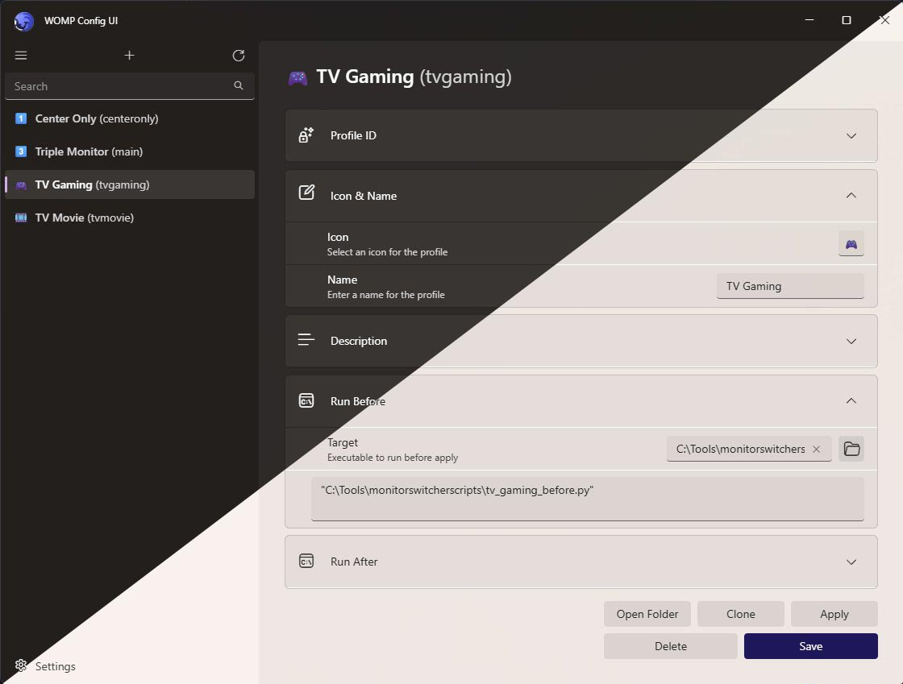
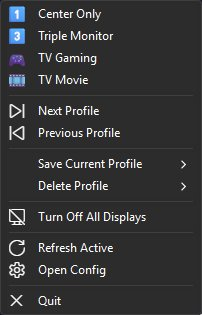
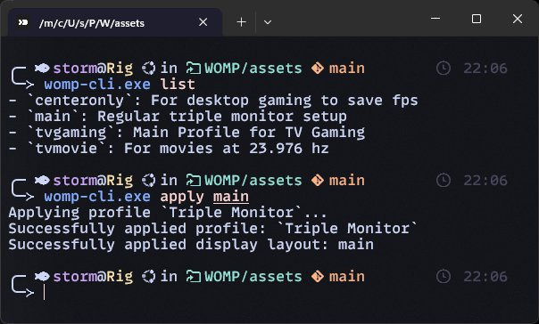

<p align="center">
<picture>
  <source media="(prefers-color-scheme: dark)" srcset="assets/banner_white.png">
  <source media="(prefers-color-scheme: light)" srcset="assets/banner_dark.png">
  
</picture>
</p>

<h1 align="center">WOMP</h1>
<h3 align="center">The Windows Output Manager Protocol</h3>

<p align="center">
<a href="https://opensource.org/licenses/MIT" target="_blank"></a>
<a href="https://github.com/nikolas-sturm/WOMP/releases" target="_blank"></a>
<a href="https://github.com/nikolas-sturm/WOMP/releases" target="_blank"></a>
</p>

---

WOMP is a modern Windows display profile manager written in Rust, allowing you to save and switch between different display configurations with ease. It's a spiritual successor to [Monitor Profile Switcher](https://sourceforge.net/projects/monitorswitcher/) by Martin Krämer, reimagined with modern technologies.

## Highlights

- 💾 **Save & Load Display Profiles**: Save your current display configuration and switch between profiles easily
- 🖥️ **Complete Display Management**: Control enabled/disabled state, resolution, refresh rate, and virtual positioning of each display
- 🔍 **Additional Display Settings**: Save and restore DPI/scaling settings and HDR state.
- 🏠 **Desktop Customization**: Preserve wallpaper & desktop icon size across profiles
- 🔊 **Audio Management**: Configure default audio output devices per profile
- ✨ **Beautiful Modern UI**: Built with Tauri and React using FluentUI components - perfectly integrating with Windows 11's design language
- 🔄 **System Integration**: Runs in the system tray for easy access
- 🛠️ **Custom Actions**: Run arbitrary commands before and after applying profiles
- 🎨 **Profile Customization**: Add custom icons to your profiles for easy identification

## Use Cases

WOMP is perfect for users who regularly switch between different display configurations:

- **Work/Gaming Setup**: Switch between a multi-monitor productivity setup and a single gaming monitor
- **Presentation Mode**: Quickly configure displays for presentations
- **TV/Media Setup**: Configure displays for optimal media viewing experience
- **Home Office/Entertainment**: Seamlessly transition between work and entertainment display configurations

### Real-world Example

A typical use case involves managing multiple displays:
- 3 desk monitors for regular work
- Single monitor gaming setup (for fewer distractions and better performance)
- TV output for gaming with 144Hz refresh rate
- TV output for movies with 24Hz refresh rate and movie mode

With WOMP, you can create profiles for each scenario and switch between them with a single click!

## Installation

### Main Installation

 **Installer**: Download the NSIS installer from the [releases page](https://github.com/nikolas-sturm/WOMP/releases)

## Screenshots

\
\- Main Window

\
\- Tray Menu

\
\- CLI App

## Command Line Interface

WOMP includes a CLI for automation:

```
womp_cli save <profile_name>   # Save the current layout to a profile
womp_cli apply <profile_name>  # Apply a saved profile
womp_cli list                  # List all available profiles
```

## Building from Source

### Prerequisites

- [Rust](https://www.rust-lang.org/tools/install) (latest stable)
- [Node.js](https://nodejs.org/) (v22+)
- [Cargo](https://doc.rust-lang.org/cargo/getting-started/installation.html)
- Windows 10/11

### Build Steps

1. Clone the repository
   ```
   git clone https://github.com/nikolas-sturm/womp.git
   cd womp
   ```

2. Build the project
   ```
   cargo build --release
   ```

3. Build the GUI
   ```
   cd crates/womp_gui
   npm install
   npm run tauri build
   ```

The compiled binaries will be available in the `target/release` directory.\
The NSIS installer bundle will be inside `target/release/bundle/nsis`

## Project Structure

- **womp-core**: Core library containing the display management functionality
- **womp-cli**: Command-line interface for basic interactions
- **womp**: Tauri/React application providing a modern GUI experience

## Contributing

Contributions are welcome! Please feel free to submit a Pull Request.

## License

This project is licensed under the MIT License - see the LICENSE file for details.

## Acknowledgments

- [Monitor Profile Switcher](https://sourceforge.net/projects/monitorswitcher/) by Martin Krämer for the original inspiration
- [Tauri](https://tauri.app/) for the excellent cross-platform framework
- [FluentUI](https://react.fluentui.dev/) for the beautiful Windows-native UI components
